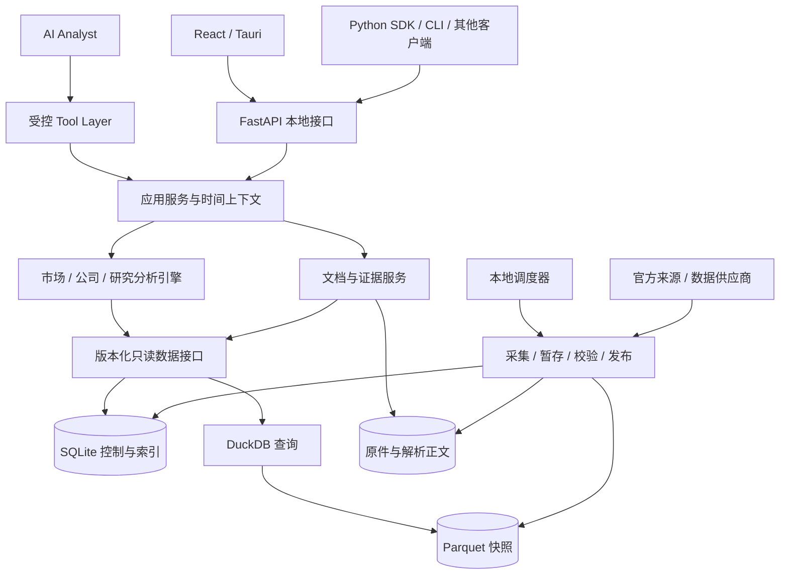

# Architecture V0.1

方向对齐：2026-10-04。关联：[PRD](PRD-V0.1.md)、[数据模型](Data-Model-V0.1.md)、[来源与风险](Data-Sources-V0.1.md)、[执行计划](Implementation-Plan-V0.1.md)。本文件区分现有基础与演进设计，不是迁移指令；动态状态和授权只见 [status](status.md)。

## 当前基础与演进边界

当前切片已有 React/Tauri、Python/FastAPI、SQLite 与不可变文件对象、固定快照及受保护的本地接口。它提供单只股票日线、两份公告和手动更新；尚无通用市场看板、论点/决定/复核系统。具体运行与验收以 README、status 和原任务报告为准。

下文模块目录、Parquet/DuckDB/Polars、调度器、全文检索和 AI 工具是设计候选，不表示已经部署，也不要求市场看板前全部建齐。默认沿用现有技术栈；存储引擎或 schema 是否扩展由实际数据规模与对应任务决定，不能因文档出现新对象直接迁移。

产品范围和先后顺序以 PRD 与路线图为准：市场与指标看板先行，论点闭环随后，交易复盘更后。L0–L3 只是资料保存等级，不是产品必须围绕的“四层架构”。

沪深300M01的具体演进设计见[看板设计§5.6](Market-Dashboard-Design-V0.1.md#56-沪深300首版p02实施设计2026-10-05)：同一本地服务新增指数专用契约与固定子根存储，保留旧002245数据库/API；复用父根写锁串行协调，不引入通用数据平台或迁移。此为实施设计，尚非已实现能力，实际授权见status。

## 1. 总体决策

沿用 **Python 模块化单体 + React 桌面界面 + 本地分层存储** 的职责方向。单个本地服务进程负责数据发布和查询，计算函数与 HTTP、AI、UI 解耦。不引入微服务、消息中间件、服务器数据库或独立向量数据库。

| 组件 | 推荐与职责 | 边界及替代条件 |
|---|---|---|
| React + TypeScript + Vite | 研究工作台、图表、证据侧栏 | 不包含金融计算或来源 SDK |
| Tauri | 桌面生命周期、启动服务、文件打开、系统密钥接口 | 先验证 Python sidecar；验证失败保留本地 Web 开发入口，但桌面验收仍未完成 |
| Python + FastAPI | 应用服务、公开本地 API | 单服务进程；不采用多个 Uvicorn worker |
| Polars + NumPy | 批量分析及明确数值计算 | pandas 仅适配必要生态；不用两个引擎重复持有全量数据 |
| Parquet + DuckDB | Parquet 保存不可变结构化版本；DuckDB 查询、聚合、可重建缓存 | 避免同一金融事实同时以两套数据库为权威 |
| SQLite | 控制元数据、主数据、小型时间序列表、任务、文档索引、引用、项目 | 文档原件不存 BLOB；现有小切片继续使用当前存储，批量事实的迁出条件以实测决定 |
| SQLite FTS5 + 中文检索预处理 | 本地关键词检索，索引可重建 | 检索初版不要求向量搜索；中文短词必须实测 |
| 文件系统内容寻址目录 | PDF/HTML、正文、表格块、少量抓取原始响应 | 校验和、引用保护、空间预算 |
| 单个调度循环 + 持久化任务表 | 日线、公告、官方栏目增量同步 | 不依赖 Celery/Redis；并发仅在下载/解析执行器内部 |

DuckDB 的本地读写模式存在单进程约束，本方案据此让服务统一拥有数据库连接，不让 GUI、脚本和独立采集进程直接共同写文件。参见 [DuckDB 并发文档](https://duckdb.org/docs/current/connect/concurrency)。

Tauri 官方支持通过 sidecar 打包外部可执行程序，且需按目标架构提供二进制；这支持本方案，但不代表 Python 依赖、签名与发布已经验证。参见 [Tauri sidecar 文档](https://v2.tauri.app/develop/sidecar/)。

## 2. 系统结构与依赖方向

下图是演进候选，包含尚未实现的分析、检索和批量存储；实际第一批看板只采用必要部分。



领域模型、指标函数与 schema 位于底层，不 import FastAPI、React 或模型 SDK。应用服务依赖存储与来源的抽象接口，具体适配器在入口装配。无需为了依赖注入框架增加复杂性，普通 Python Protocol 与构造参数即可。

纯引擎可直接在 Python 脚本里运行，输入为 DTO 或已固定的只读快照。常规 SDK 默认调用本地服务；服务离线时，离线分析只读取通过导出清单固定的只读数据及原件。若采用 DuckDB，不打开其他进程正在使用的可写文件。Codex 等客户端将来可通过同一工具注册表的适配层调用，早期不强制实现 MCP 服务。

### 2.1 对象、生命周期与服务

| 维度 | 概念与关系 | 工程含义 |
|---|---|---|
| 对象 | Thesis、子问题/假设、Evidence、Decision、Policy、State Snapshot、监控变量、Review | 行业/公司/估值论点可关联多个标的；一决定多论点、一证据多假设；不强行等同于一公司一项目 |
| 生命周期 | 想法、论点、研究、决定、监控、再评估、复核之间循环 | 允许不操作和直接复核已有持仓；不是必须逐步完成的交易流水线 |
| 服务 | 采集、存储、检索、计算、AI、图表、通知 | 支持对象与流程；公共参考序列也可独立于具体论点长期维护 |

市场/公司页面与论点页面通过应用服务共享数据和证据。市场总览是默认入口；研究页面按论点展示相关变量，不另建一套无版本约束的数据事实。

既有设计中的 `claim` 表达可引用的判断，不能直接替代完整 Thesis；现有数据快照固定金融输入，不能直接替代 Decision Snapshot。概念关系与旧逻辑 schema 的兼容边界见数据模型；具体映射和迁移待相关阶段设计。

## 3. 模块边界

| 模块 | 拥有的数据/责任 | 对外接口 | 不负责 |
|---|---|---|---|
| identity | issuer、instrument、代码历史、交易日历、行业体系与成员版本 | resolve_instrument、get_universe | 行情抓取、股票推荐 |
| ingestion | 来源注册、采集游标、标准化、质量检查、批次发布 | sync_dataset、backfill_range | 直接产生投资结论 |
| market | 市场/指数/行业/个股描述性分析 | snapshot、history、sector_state | 公司业务理解、模型调用 |
| company | 公司资料、基础财务查询、valuation profile | profile、financials | 从概念标签推断主营 |
| documents | 索引、原件、解析版本、文本块与检索 | list、archive、search、open | 自动确认 AI 观点真实性 |
| evidence | 文本与计算证据、claim、引用验证 | create_claim、resolve_citation | 将有链接等同于结论被证明 |
| research | 原话、论点/子问题、决定、个人规则与状态、复核及关注关系的演进设计 | 概念接口待对应阶段细化，旧 create_project/save_report 仅候选 | 交易执行、完整账户收益核算 |
| tools | JSON schema、工具授权、限额、统一返回 | execute_tool | 自由执行模型代码/SQL |
| analyst | 提问拆解、工具调用、证据整理、回答生成 | answer | 直接读数据库或当作事实源 |
| jobs | 时间计划、执行状态、租约、重试、追补 | schedule、retry、cancel | 自带第二套抓取逻辑 |
| storage/ops | 清单、迁移、备份、空间、日志、健康 | publish、backup、verify | 决定金融口径 |

模块调用走应用服务或公开接口，不跨模块修改表。将来若创建研究项目需要同时生成任务，应用服务可在同一 SQLite 事务中写入，不必引入事件总线；保存想法不默认启动联网研究任务。

## 4. 两条数据流

### 4.1 日线与结构化数据

触发任务 → 固定来源/日期分片 → 下载原响应至暂存区 → 记录请求指纹与获取时间 → 单位/标识标准化 → 验证声明覆盖范围、重复键、价格与时间条件 → 写不可变数据版本（Parquet 等物理方案按需选择）→ 计算校验和 → 原子发布清单 → 更新游标 → 失效相关派生缓存 → 更新界面。

按日期/交易所切分，响应达到供应商条数上限时必须检查截断或分页，不把“请求成功”当作“全市场完整”。个股停牌、未上市、退市后、源缺失分开记录。缺一证券不静默补零。

### 4.2 公司资料与研究回答

公告索引增量 → 文档身份/版本去重 → 根据归档策略获取原件 → 原件校验 → 解析正文与表格 → 定位页码/段落 → 构建检索索引 → 查询时先限定公司/时间/来源 → 返回证据片段 → AI 生成带 claim 的回答 → 引用与数值校验 → 保存报告及固定证据。

公告发现和原件归档按重点证券与实际研究范围展开，不以全市场索引为前提。已选宏观序列保留来源发布与修订依据；普通栏目是否归档按研究需要决定。若回答引用尚未归档的网页，应先归档支持片段与版本，才能承诺未来可重放。

## 5. 数据分层与权威来源

L0/L1/L2/L3 是保存策略，不是四套重复数据库：

- L0：文档或资料的身份、来源、时间、链接及状态，可能无正文。
- L1：证券/行情/财务/宏观等结构化事实和版本；物理权威存储在对应任务中确定，现有切片与未来批量 Parquet 候选区分，不能同时维护两份权威事实。
- L2：解析正文、块定位、元数据；若没有原件，不声称可恢复原版视觉布局。
- L3：原始 PDF/HTML + L2 + 可重建的检索索引。AI 索引不要求一定有向量。

此外有 staging（暂存与隔离）、derived（派生缓存）、manifest（有效数据清单），不把它们混作保存等级。每份资料同时记录目标等级和实际完成等级，下载失败不能显示“已完整归档”。

详细表键、单位、时间与容量在[核心数据模型](Data-Model-V0.1.md)。

## 6. Point-in-Time 作为查询上下文

每个研究请求都携带：`as_of`（信息截止时刻）、`pit_mode`、`data_snapshot_id`、`timezone`。行情日期是被研究的日期，不等同于信息截止时间。

- `reconstructed_public`：用具有可靠发布时间/修订发布时间的历史版本，恢复当时公众可以知道的资料；允许资料今天才下载，但必须能证明那个具体版本当时已公开。
- `observed_local`：除前述条件外，要求本系统当时已观测到该版本；可审计本机历史。
- `latest_revised`：使用今天已知的最新修订数据描述过去，仅供明确标注的事后分析，不冒称 PIT。

版本选择必须在计算、筛选和检索之前执行。搜索召回、公司画像、行业成员、估值分母、复权因子、报告摘要和缓存都必须受同一上下文约束。缓存键至少包括时间模式、截止时刻、输入清单、参数、算法版本与归类版本。

没有原始 vintage 的历史宏观值、最新回溯估值、现在的行业归类，不能通过添加早期日期伪装成 PIT。普通 API 也不能绕过这一限制。允许缺失并返回原因，不给模型拼接不符合时间条件的摘要。

## 7. 官方采集与来源适配

定义小型 `SourceAdapter`：`capabilities()`、`list_updates(cursor, window)`、`fetch(item)`、`normalize(raw)`。返回来源原始标识、分页信息、时间精度、原始单位、许可元数据和校验信息。

每个来源配置允许域名、并发、速率、超时、重试、回看窗口和版本化解析器。优先公开下载/API/稳定栏目；浏览器自动化仅用于必要且允许的适配，不作为所有数据的默认采集方案。

游标使用发布时间加源记录 ID 的稳定顺序；每次重读最近窗口以捕捉迟到、置顶和更正记录，按身份与内容哈希去重。网站只支持日期查询时使用重叠日期分片并遍历所有页，不能仅取“第一页最新公告”。

失败分级：网络/限流 → 指数退避和抖动；权限/认证 → 阻塞来源并提示配置；schema 漂移/异常 HTML → 隔离原响应，禁止发布；官方源暂不可用 → 按字段口径执行已验证 fallback 或显示过期。具体矩阵见[来源附录](Data-Sources-V0.1.md)。

## 8. 文档、解析与中文检索

逻辑公告 `document_id` 与内容版本 `document_version_id` 分开；同一公告在多站镜像保留多个来源链接，同一个 URL 内容改变生成新版本。同名标题不同公司不能合并。文件按 SHA-256 去重，法律主体和公告身份仍分别保存。

PDF 提取优先文本层，HTML 保存正文和来源结构；解析初版允许扫描件进入 `ocr_required` 队列并人工查看原件，OCR 自动化可后续加入。页码存 PDF 物理页号和印刷页标签；表格保留表头、单位、行列关系及跨页关系，不能将丢失单位的数字扁平化为可信财务事实。

文本块按标题/段落/表格边界拆分，保存 parser_version、text_hash、页范围与字符偏移；偏移针对不可变解析版本。解析器升级生成新块，不覆盖旧引用。

FTS5 负责关键词召回；原文独立存储，搜索字段可采用确定性的中文分词/双字词预处理。不能假设默认 tokenizer 就能覆盖中文；trigram 对小于 3 字符的检索存在限制，因此“铜”“银行”等短查询需专门精确词/标题检索路径。该技术限制见 [SQLite FTS5 文档](https://www.sqlite.org/fts5.html)。实现检索时用固定中文问题集验收召回；向量检索只在后续证明增益后引入，且不替代时间过滤。

## 9. 证据与 Citation

证据有两类：

1. `document_evidence`：具体文档版本、来源 URL、发布/获取时间、页/段/表格坐标、支持片段及哈希。
2. `computation_evidence`：数据清单、输入记录选择条件、指标公式版本、参数、时间上下文、单位、结果及结果哈希，可跳转到数据明细与复算说明。

`claim` 与证据是多对多。关系注明 supports / contradicts / context；claim 分类为 source_fact / calculated_fact / inference / user_note，状态为 draft / supported / disputed / insufficient。`supported` 表示当前证据关系支持，不是对事实绝对真实的认证。公司陈述、监管信息、第三方估计保留各自来源性质。

证据关系还需表达来源性质、预测/事实、依赖同一原始报告、适用期限与冲突；可靠程度不压缩成唯一可信分数。AI推断保留为分析，不循环生成新的独立外部证据；确定性计算仍需固定输入与公式。

一份收入占比结论必须指向分子、分母、期间、币种及合并范围一致的证据；两段不同年度文本不能拼成当前占比。多项业务数值加总不一致时给差异，不强行补齐。

输出校验分两级：确定性检查引用存在、时间可用、片段属于该版本、数值可复算；语义检查证据是否真支持 claim。后者通过固定评估集和人工抽查验证，模型自检只能辅助。无证据的关键结论被降级为未知/推断或移除，不能编造 citation ID。

点击 citation 打开本地原件定位 + 支持片段，附官方 URL；外链失效不应破坏已归档证据。报告固定输入与引用版本；被引用的文件与派生证据进入保护集。

## 10. AI Tool Layer

候选工具使用同一 Python 服务接口上的注册表和有版本 JSON schema，REST 与 AI 调用共享校验。早期单助手仅辅助结构化、少量问题和指定资料分析，不预设自主全市场检索或多 Agent。

下表仅为能力接口目录。第一阶段的行情与指标不依赖 AI 连接；论点阶段再确认模型、调用边界和费用。旧 V0.x 排期不作为这些接口的实现约束。

| 工具 | 关键入参 | 输出/阶段 |
|---|---|---|
| `market.snapshot` | universe_id、trade_date、context | 成交额、宽度、指数、覆盖与计算证据；按实际阶段 |
| `market.history` | metric_ids、start、end、context | 有限长度时间序列与单位；按实际阶段 |
| `stock.get` / `stock.history` | instrument_id、date/range、adjustment、context | 基础资料、日线、复权锚点；按实际阶段 |
| `industry.state` | taxonomy_id、industry_id、date、context | 当前或已支持 PIT 的行业状态；按实际阶段 |
| `company.profile` | issuer_id、context | 业务 claim 与证据，不生成无依据画像；按实际阶段 |
| `documents.list` / `documents.search` | issuer_ids、query、types、context、cursor | 标题/段落、来源、页码与 citation；按实际阶段 |
| `evidence.get` | evidence_ids、context | 精确证据内容；按实际阶段 |
| `indicator.calculate` | 白名单 indicator_id、instrument_ids、parameters、context | 固定公式计算结果；按实际阶段 |
| `company.financials` / `stocks.compare` | metric_ids、periods、profile、context | 结构化财务及同行可比性；按研究需要 |
| `macro.series` / `global.context` | series_ids、range、context | 已选公共序列支持首批看板，AI接口按需；保留修订版本 |
| `stocks.screen` / `statistics.run` | 白名单过滤/统计规格、universe、context | 可重放筛选、样本分布；后续研究 |
| `events.study` | events、windows、benchmark、context | 事件研究与偏差说明；后续研究 |

未来工具在注册表中不暴露为“已可用”。最小返回协议示例（字段值仅用于说明）：

```json
{
  "schema_version": "1",
  "tool": "market.snapshot",
  "status": "partial",
  "context": {
    "as_of": "2024-09-24T15:00:00+08:00",
    "pit_mode": "reconstructed_public",
    "data_snapshot_id": "snapshot-example"
  },
  "data": {},
  "evidence_ids": [],
  "quality": {
    "coverage": null,
    "freshness": "unknown",
    "pit_support": "unavailable"
  },
  "warnings": ["当时的完整日线数据可用时间尚未验证"],
  "error": null,
  "trace_id": "trace-example"
}
```

统一状态 ok / partial / unavailable / error；错误码含 SOURCE_UNAVAILABLE、PERMISSION_REQUIRED、DATA_GAP、PIT_UNSUPPORTED、INVALID_ARGUMENT、RESOURCE_LIMIT。所有输出携带单位和数据期间；大结果分页或返回本地结果 ID，禁止把全市场十年数据塞进提示词。

工具默认只读，不暴露任意 SQL、Python eval、Shell 或不受控外链下载。研究项目创建、归档和重试由明确 UI/CLI 命令触发。模型只能调用白名单统计，超时、行数、工具步数和 token/费用上限均可配置；重试也计入预算。

文档内容视为资料，不能改变系统指令或工具权限。模型调用前只发送必要片段；远程模型为可选连接，首次配置明确告知会发送的问题与资料类型；个人资金、持仓与规则默认只提供分析所需的最小上下文，发送范围待该阶段确认。密钥存系统安全存储，不写入项目或日志。没有模型配置也能使用整个数据与证据系统。

## 11. 定时任务与进程生命周期

自动更新、提醒通知和休眠后追补仍待产品设计及相应授权；收盘后使用不等于启用定时器。现有日常切片启动不采集、用户点击才更新，不能由下方候选方案改变。

后续调度候选为服务单实例锁 + SQLite 持久任务表。调度循环只生成到期任务；执行器按来源限流，下载可小规模并发，解析可放独立受限子进程，结果由主进程统一发布。

原定时方案示例（未确认默认值；仅在相关自动更新范围确定后评估，Asia/Shanghai）：

| 任务 | 原建议频率 | 行为 |
|---|---|---|
| 交易日历/证券主表 | 启动及每日 |先更新全集与交易状态，再计算缺口 |
| 日线/每日指标/复权 | 交易日 18:30，缺口 21:30 补查 | 时间只是检查点；以源数据完整性决定发布 |
| 已选公司公告/研究资料 | 每日 08:30、20:30 | 公告周末也更新，不能只跟交易日 |
| 宏观/政策栏目 | 每日两次 | 后续可按官方发布日历优化 |
| 近期数据回看 | 每周 | 重检近期窗口；更早修订按来源公告或周期审计发现 |
| 空间/清单巡检 | 启动、写入前、每日 | 不在低磁盘时继续大批下载 |
| 备份与恢复校验 | 每周增量；发布前一致性快照 | 定期在临时目录恢复验证 |

未来若采用此调度方案，应用关闭/电脑休眠时不执行任务；是否启动追补须单独设计，不能改写当前启动不采集的约定。可考虑合并错过触发，按缺口追补而不逐点重放。不承诺关机仍同步。后台系统服务留后续可选，且必须复用同一服务实例。

任务状态 queued → running → succeeded / retry_wait / failed / cancelled；运行租约过期后恢复，取消先完成或中止当前安全写入边界。幂等键为 job_type + source + dataset + date_slice + config_version；抓取重试不等于数据新版本，内容变化才新增版本。

## 12. 原子发布、恢复与完整性

跨 SQLite 和文件系统不假设有分布式事务。采用“文件先就位，最后提交清单”的协议：

1. SQLite 创建 staging 批次；文件写同磁盘临时目录，完成 flush/fsync 和校验。
2. 文件重命名至不可变最终路径；此时尚不可被查询发现。
3. 单个 SQLite 事务写有效 manifest、批次状态、来源游标与最新快照指针。
4. 查询仅读取该快照 manifest 列出的文件，禁止目录 glob 发现未提交文件；派生结果使用该快照 ID。
5. 崩溃于第 3 步前：旧快照有效，启动清理/续作孤立文件；崩溃于第 3 步后：重建缓存，不重复提交。对账检查 manifest 指向的每个文件均存在且哈希一致。

查询启动时固定清单，完成前引用文件不能 GC。修订写新文件，旧版本保留；压缩合并允许更改物理布局，但需要原子替换清单、保留被报告固定的数据版本。内容去重和无语义变化的压缩不是删除历史事实。

质量校验覆盖主键唯一、数值类型、币种与单位、OHLC 区间、非负量额、因子有效、源行数/分页、证券存续时间、涨跌比较口径和成员分母。异常隔离不会连带删除上一有效版本。提供按来源、日期和证券的缺口报告，不能只显示“同步成功”。

数据结构迁移编号管理，变更前备份；开发期间优先加列/加表及新 schema 文件。遇到不兼容格式不尝试强开。回滚应用需验证仍能读原数据版本；不能通过删除用户数据实现回滚。

备份采用暂停发布、固定 manifest、SQLite 一致性备份及对应不可变文件集合；DuckDB 派生缓存可不备份。恢复到新目录，校验哈希/引用/报告重放后再切换。没有外部磁盘时，本机快照只能防误操作，不能声称防设备损坏。

## 13. 空间管理

数据根独立于代码目录，可迁移；150 GB 软上限包含应用金融数据、原件、索引、缓存、暂存、日志及本机备份，不把备份藏在预算外。详细预算见[数据模型](Data-Model-V0.1.md)。

按内容大小与写入峰值预留空间；旧提案的 120/135 GB 阈值未经确认，不作为当前默认。150 GB 软上限继续有效，容量紧张时提示并暂停非必要新增，具体预警阈值按实测设计。另设文件系统剩余空间保护，阈值取固定底线与待任务峰值中的较大者。

清理顺序：可重建缓存/临时文件 → 过期下载残片 → 未被引用的重复中间产物 → 用户同意后非重点归档降级。长期结构化历史、取消自选后的已有历史、引用中的原件、用户原话、规则旧版本、决定与复核及固定报告不自动删。若保护数据本身逼近上限，应迁移数据根、扩大预算或暂停采集，不能靠悄悄丢失历史达标。

## 14. 本地接口与安全边界

FastAPI 只绑定 loopback，端口配置与随机会话 token 由桌面父进程安全交给 UI；限制 Host/Origin、拒绝开放 CORS，所有读写接口均校验 token。这是本地进程访问保护，不是产品账号/登录系统。

文件接口只使用受控 object_id，拒绝任意路径；下载链接限定配置来源及跳转域，避免服务端随意访问内网。HTML 原件以净化文本或沙箱视图展示，不执行来源脚本。下载、解压、解析设置文件体积、时间与内存上限。

Tauri 管理子进程启动、健康检查和优雅退出；重启不重复启动服务；现有实例唤回与子进程生命周期按已验收契约保留；不因端口占用而复用无法认证归属的服务。打包验收必须覆盖 Python 原生依赖与目标 CPU 架构。

## 15. 日志与可观测性

本地结构化 JSONL 日志，统一 trace_id / job_run_id / tool_call_id / batch_id / snapshot_id；记录模块、来源、耗时、行数、状态、重试与错误码。日志默认轮转，建议保留 14 天并限制总量，不写密钥、完整提示词和全文资料。

任务审计与研究运行元数据单独持久保存，生命周期不能被日志轮转截断。数据管理页展示来源新鲜度、缺口比例、检索质量、引用失败数、队列积压、磁盘增长和最近备份验证；无需上 Prometheus/Grafana。

诊断导出包含环境、schema/适配器版本、匿名化错误和清单摘要；用户资料及密钥默认不打包。

## 16. 测试策略

| 类型 | 验证重点 |
|---|---|
| 领域单元与属性测试 | 单位转换、复权锚点、停牌/除权、新股样本、分母、行业重叠、财务期间 |
| 时间正确性测试 | 盘后发布、发布日期精度、修订、迟到抓取、退市样本、历史行业、未来分红；“加入未来数据不改变旧 as_of 输出” |
| 来源契约测试 | 固定脱敏响应、字段漂移、分页截断、权限、限流、空结果；实网 smoke 独立且限量，不阻塞纯离线测试 |
| 集成与故障注入 | 原子发布各断点强杀、断网、磁盘满、损坏文件、重试幂等、恢复与迁移 |
| 文档与检索金标 | 中文短词、表格单位、页码定位、扫描件状态；固定正确片段和查询预期 |
| AI 评估 | 无证据拒答、恶意文档、概念与业务混淆、错年占比、来源冲突、PIT；结构校验 + 人工语义检查 |
| UI/E2E | 按阶段验证总览/指标/资料、原话→论点→决定→复核、离线降级、日期切换与模型不可用 |
| 性能/容量 | 目标机器与固定数据集；记录冷热缓存；度量日增长及初始回填峰值 |

重点保护会造成错误研究结论或数据损坏的路径；不为纯样式变更编写镜像测试。所有发布条件及任务对应见执行计划。

## 17. 推荐项目目录（演进候选，不代表完整目录已实现）

```text
TheWolf/
  README.md
  docs/                      # PRD、架构、数据源、计划、后续决策记录
  apps/
    desktop/
      src/                   # React 页面、图表、证据视图
      src-tauri/             # Rust 生命周期与打包
  python/
    pyproject.toml
    src/pmi/
      domain/                # 实体、单位、时间、分析纯函数
      identity/
      market/
      company/
      documents/
      evidence/
      research/
      ingestion/
        adapters/            # 每个来源独立；版本、口径映射
      jobs/
      tools/                 # schema、registry、policy
      analyst/               # provider adapter、回答契约
      storage/               # sqlite、parquet、manifest、对象存储
      api/                   # FastAPI 路由，薄封装
      sdk/                   # 本地客户端与离线快照读取
      cli/
      ops/                   # 空间、日志、备份
    migrations/
    tests/
      unit/
      contract/
      integration/
      fixtures/
      evaluations/
  contracts/                 # API/Tool schema 导出，不重复手维护
  scripts/                   # 开发、打包和验收入口

<user-data-root>/             # 与源码隔离，不进入版本控制
  metadata.sqlite
  lake/<dataset>/<partition>/<version>.parquet
  objects/sha256/<prefix>/<hash>
  parsed/<document-version>/<parser-version>/
  staging/
  derived/analytics.duckdb
  logs/
  backups/
```

后续交易行为分析可新增 `behavior`，通过只读研究接口访问行情、通过独立导入接口接收交易记录；当前不创建交易执行模块。
