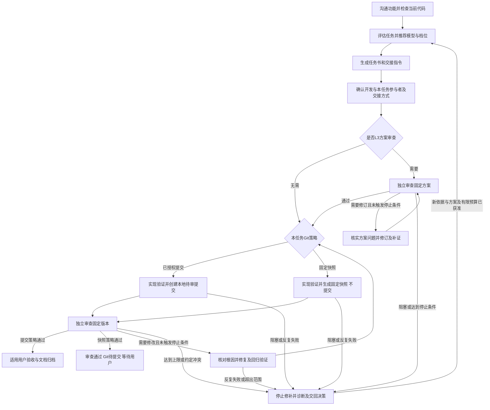

# 代码实施任务书与交接流程

本流程是 [AGENTS.md](../AGENTS.md) 的任务组织细则，配合[代码编写规范](Coding-Standards.md)和[独立审查规范](Independent-Code-Review-Policy.md)执行。本流程维护版本、交接、报告、计数与恢复；审查等级、实质检查和通过判定以独立审查规范为准。目标是在质量要求不变的前提下，让规划成果可以交给不同模型或不同厂商的 Agent 执行，减少重复沟通和无效返工。

当前授权、进展、开放问题及下一步以 [status.md](status.md) 为唯一状态来源；授权记录与来源核验遵循 [AGENTS.md 第十二节](../AGENTS.md#十二授权沟通与交付)。生成任务书不自动授权执行；用户明确执行代码开发/修复任务时，必要的局部实现、隔离测试和修复包含在授权内。按用户 2026-09-30 确认的规则，无更具体禁止提交约束时，完成后还应创建第 7 节规定的本地待审提交，无需逐轮重复请求授权。仅规划、规则编辑、审查报告及文档归档不自动获得提交授权；amend、推送、合并、Tag、发布和真实数据迁移另按明确授权执行。

**自动任务书模式与Git策略**：2026-10-04确认的自动模式默认采用第7.2节固定快照审查，结束停在“Git待提交”；2026-10-07确认按任务选择参与者和协作方式，详见第9.4节。模式须先开启，并在任务书及执行安排形成后取得本人开发确认。自动模式关闭时，新代码任务仍沿用已有本地待审提交约定，更具体的用户授权或禁止项优先。

人工复制或自动传递是交接渠道，与本任务已确认的Git策略分别记录。改变渠道、Agent或平台不改变版本依据、提交权限、预算及修复计数；因此自动模式任务改为人工转交后仍按固定快照审查、不提交。下文提交版字段只适用于采用提交策略的任务，固定快照任务按第7.2节替换。不得改写历史审查依据或把快照指纹冒充Git提交SHA。

## 1. 工作流程

下图适用于需要独立审查的代码任务；文档等低风险变更按 AGENTS.md 第十节完成适用检查，不机械增加开发或审查窗口。



### 第一步：沟通功能并检查当前代码

规划者先读取适用规则、当前状态及相关代码，再与用户明确目标、范围、可观察的结果和影响本轮验收的问题。区分已经确认的决定、实现建议与待查事实，保留关键决定的原因。

任意 Agent 可提出规划建议。用户可按需征求多个独立意见并决定取舍，再指定一个 Agent 修改正式文档；不要求每项任务同时取得多方意见，也不让不同工具各自维护一套有效需求或状态。前后端分工只按具体任务约定，不形成厂商的固定职责。

检查所需接口、依赖及现成实现是否存在；不能通过已读材料确认的事实标注未知。若关键技术路径尚未验证，先提出范围明确的最小验证任务，在已有授权内执行，不能把猜测写成可直接实施的方案。

### 第二步：评估任务并推荐模型与档位

功能细节明确后，规划者依据实际代码按第 2 节给出简短评估。对于需要较多判断的任务，由高能力模型完成规划；明确的小改动允许执行模型直接做简要评估，不强制每项任务使用高能力模型。

评估结论可以是直接执行、按任务书交接、先完成最小验证，或由高能力模型处理关键部分后再交接。不能为了使用较低成本模型而缩减验收要求。

### 第三步：生成任务书和交接指令

需要新任务或其他 Agent 接手时，按第 3、4 节生成仓库内可独立读取的任务书。任务以一次可独立验收的行为变化为单位；同一范围内的常规修复沿用原任务书。

向用户返回：任务 ID 与文件链接、评估摘要、首选模型及推理档位、推荐理由，以及可直接复制的执行指令。只给 ID 时必须能按约定找到唯一文件，不依赖平台内部任务 ID 或原始聊天记录。

### 第四步：确定执行者、审查者和交接模式

用户按任务选择牵头者、执行者和适用的独立审查者及工具/模型/档位。牵头者可兼任开发者、联调负责人及状态维护者；一个 Agent 可以完整实现一个小功能。按独立审查规范第2节确定等级、重点及适用验证，等级与会话渠道分开记录。代码独审由未参与实现的独立上下文承担；L3方案独审由未参与所审核心方案制定者承担，通过后才实施。可使用同厂商或不同厂商的Agent；缺少必要审查时保留待审，不以自检替代。

未获自动交接授权时人工转交；自动模式按第9.4节采用本任务已确认安排，工具支持才自动传递。优先复用适合的会话，审查上下文仍须独立。用户已明确“由你负责”等安排时沿用，不重复询问；未指定的角色先提出简短建议，与本次开发确认一并确定。推荐不自动创建会话、切换模型或启动并行执行。执行环境须能访问对应代码、任务书及必要引用。

新工作树或其他机器未必包含原目录的未提交、未跟踪文件，交接前须核对相关文件是否齐全。按本任务Git策略使用固定提交或第7.2节固定快照；必要补充材料单列版本或哈希，不能冒充已包含在该版本。多个任务同时工作时，写入责任和隔离方式遵循 AGENTS.md；拆分前后端时明确接口约定、联调负责人及真实接口验收，不能各自测试通过便认定整项完成。

### 第五步：核对基线并分段实现和验证

执行者按第 4 节先读取适用规则、状态当前区和任务材料，检查相关提交、未提交改动、运行环境及实际模型配置。L3先核对固定方案及独立方案通过依据，不能绕过前置审查开始依赖它的实现。按第 10 节选取适用验证入口。缺少文件或权限时先明确缺口；不能假装已读或自行用猜测补齐。

基线发生变化时，判断是否影响本任务约定。无关差异不阻断工作；相关差异应查明并同步必要的任务书内容。关键假设失效时暂停受影响部分，保留可继续的独立工作，返回证据供重新评估。

按步骤完成、验证并修复每个切片。常规局部选择自主处理；出现范围变化、重要数据语义变化或持续失败时按第 8 节停止条件及第 2 节升级方案处理。执行者可以提出任务书有误，不得通过删除有效测试、降低校验或修改正确业务规则来符合错误方案。

### 第六步：审查交付并记录结果

执行者按第 7 节交回固定版本与验证材料；审查者依据独立审查规范检查，按第 8 节输出发现、关闭条件及复审结果。审查者检查实际代码和证据，也检查原方案是否正确，不能只阅读执行者的完成摘要。交接与最终收尾按第 9 节执行。

按 AGENTS.md 第十节完成与风险相匹配的检查和独立审查。关键业务规则、跨模块难题优先由高能力模型参与审查；低风险文档修改按既有规则自检即可。记录实际审查者、方式及所审版本，缺少必要独立审查时明确保留待完成项。

在 status.md 中更新进展与开放问题，区分实现完成、验证通过、用户验收和发布完成。适用时同条简记实际模型及档位、推荐是否合适、返工与用户介入情况；仅记录能取得的用量或耗时，不推算虚假精度。详细证据较多时链接验证报告，不另建模型评测系统。

## 2. 任务评估与模型推荐

评估直接放在任务书开头，无需独立报告或新增审批。分别说明下列四个维度，并用实际发现解释判断，不按改动行数或文件数量机械打分。

| 维度 | 简短结论 | 判断依据 |
|---|---|---|
| 实现复杂度 | 低 / 中 / 高 | 逻辑分支、模块依赖、接口联动、可复用模式 |
| 错误影响 | 低 / 中 / 高 | 影响范围、可恢复性、数据与研究结果是否可能失真 |
| 技术不确定性 | 低 / 中 / 高 | 来源、接口、依赖、设计假设是否经过验证 |
| 可验证程度 | 充分 / 部分 / 不足 | 预期结果、自动化检查、真实接口或界面验证是否可用 |

评估同时包含：

- **执行建议**：直接执行、按任务书交接、先验证，或高能力模型先处理关键部分。
- **首选配置**：说明实际工具、模型及可用档位，能取得时附配置标识；工具未提供档位或配置不可核实时如实标注。沿用用户已指定的配置，不假定不同工具存在相同档位。
- **推荐理由与把握**：说明为什么该配置适合当前任务，标明高 / 中 / 低把握及依据；缺少同类实测时如实说明。
- **升级方案**：给出一个更适合处理已识别难点的候选模型与档位，或明确回到规划者验证哪项假设；写清触发条件和交接材料。
- **审查等级与重点**：按独立审查规范说明L0–L3及触发依据，指出最值得检查的行为、证据和实际消费者；L3列明实施前固定方案及通过条件。

选择原则：

1. 模型能力与推理档位分别判断，不默认高档，不假设小模型提高推理档位即可替代更强模型。不能把推荐把握当作成功率承诺。
2. 优先依据本项目同类任务的实际结果，其次参考当前官方定位。确认目标执行工具实际可选的模型和档位；无法核实时注明限制，不把 API 支持等同于用户工具可用。
3. 模型清单会变化，规则不维护永久的型号排名或价格表。可复用本次会话已核实且仍适用的信息，不为每个小任务重复完整调研。
4. 配置建议不绑定厂商或前后端职责；任务书使用通用文件、命令和接口表达。换用其他工具或模型时保留能力要求与验收约定，不假定存在一一对应的模型或档位，也不因新建议擅自更换已确认配置。
5. 升级条件须具体：例如关键契约需要改变、关键假设失效，或同一问题经过约定的有依据修复仍失败。未另行约定时执行第 8.4 节的默认有限次数；任务开始前可明确调整，执行者不得自行放宽。每次尝试应有假设及验证结果，避免无依据反复试错。
6. 升级时交回复现步骤、预期与实际结果、相关日志、代码差异、已尝试方法和剩余问题。技术诊断交给合适的执行者，产品含义、范围和重大取舍仍由用户决定。

## 3. 任务书的最小信息标准

每个代码任务开始修改前都要明确下列信息。简单改动可以合并为短段落或现有任务记录；跨任务、跨模型或跨厂商交接时，必须有可定位的仓库内任务书。无相关影响时注明不适用及必要原因，不凑篇幅。

| 项目 | 必须明确的内容 |
|---|---|
| 1. 目标与范围 | 解决的问题、可观察变化、包含与排除项；引用已确认需求及 status.md 中的授权依据 |
| 2. 当前代码依据 | 仓库及分支、提交版本、相关未提交/未跟踪改动；实际读过的代码与文档入口、当前行为、已知和未核实事实 |
| 3. 改动位置与边界 | 预计影响模块、文件、调用者和兼容性；现成实现与复用入口，必须保持的行为 |
| 4. 关键实现约定 | 输入输出、数据与错误契约、业务规则、设计依据；区分必须遵守的约定和执行者可自主选择的细节 |
| 5. 实施步骤 | 步骤依赖、每步产物和检查点；必要的运行环境、依赖准备、启动命令及隔离测试数据 |
| 6. 验收与验证 | 前置条件、输入或操作、可观察结果、验证方式与适用命令；审查等级/理由、适用检查及L3方案审查；必要正常、边界和失败场景；命令是否已实测及环境限制 |
| 7. 自主处理与升级条件 | 可自主解决的问题、修复次数与停止条件、返回规划者或用户的触发条件与材料；默认引用第 8.4 节 |
| 8. 交付要求 | 第 7–9 节固定版本、审查与文档要求；本任务参与者、交接方式、Git策略、写入责任及授权依据见当前状态 |

按任务补充相关内容：UI 改动附设计依据、状态与实际界面检查；数据任务附来源、单位、时间、版本、完整性和恢复约定；迁移附已有数据影响与恢复办法；权限及外部接口改动附边界、异常和实际消费者验证。具体要求引用 AGENTS.md 和代码规范，任务书只补充本轮细节。

使用仓库相对路径说明文件位置，明确命令工作目录及平台差异。不得依赖原聊天中的“刚才那个方案”，也不得假设其他 Agent 自动读取 AGENTS.md。专属工具确为必要时列明依赖、可用替代方案或缺失时的处理方式。

常规验证引用 README 的入口 ID 与位置，只补充本任务的测试选择、隔离输入和预期结果，不在任务书复制整套命令。涉及关键业务语义时列出少量正例、反例和必须保持的行为，再建立与验证入口的对应关系；没有命令覆盖的验收明确注明人工或专项方法。

## 4. 文档组织与任务标识

- 交接任务默认一项一文件，首次需要时再创建 `docs/tasks/`。文件名采用 `TASK-YYYYMMDD-NN-简短名称.md`，任务 ID 为 `TASK-YYYYMMDD-NN`；创建前检查该 ID 未被占用，不复用旧 ID。
- 既有执行计划的 T01–T30、S01–S04 保持不变。任务书按需引用其具体子范围，不以完成一份任务书宣称整个路线任务完成。
- 任务书保存实施约定、制定日期及代码依据；当前授权、执行者、进展、开放问题和下一步只在 status.md 维护，并链接任务文件。不再创建另一份任务状态总表。
- 任务生成后，在 status.md 简记该任务 ID、文件链接及实际授权/进展；明确是仅形成方案，还是已有执行指令。若实际任务范围获授权后变化，及时更新相应来源，不把静态任务书当作最新授权。
- 同范围修复沿用任务书及问题 ID；约定改变时更新必要内容及其依据，不静默扩大范围。开发交接按第 7 节及本任务Git策略固定版本；纯规划材料使用已授权的 Git 历史或可核对快照。
- 当前任务模式、交接方式、Git策略、指定参与者、唯一状态维护者、授权、所处理的版本、修复计数和问题处置只在 status.md 维护。交接摘要及报告是对应轮次的证据快照，注明所审版本；不另建重复的实时台账。其他工具的本地记忆只能作为查证线索，不能覆盖当前规则和状态。
- 只读出文件不代表具备完整上下文。执行者须能取得相关未提交代码、规范及必要引用资料；无法取得时明确缺口。

### 4.1 阅读顺序与信息归属

按“适用 AGENTS.md → status.md 当前区 → 本任务材料和适用规范 → 相关源码与 README 验证入口”取得上下文。代码实施/审查须读代码规范及独立审查规范的适用等级与检查项；规划重点读本流程第 1–6 节，开发交付读第 7/10 节，审查修复读第 8 节，跨 Agent 交接再读第 9 节。已有上下文只补读变化部分；按需读取不免除适用规则。

| 来源 | 维护内容 | 其他位置的使用方式 |
|---|---|---|
| AGENTS.md | 持续适用的边界与规则入口 | 引用，任务书只写特例 |
| status.md 当前区 | 有效范围/授权、执行者和模式、版本、开放问题、必要验证摘要与下一步 | 先读；没有活动开发任务时注明，不预建空轮次表 |
| 任务书 | 目标、契约、验收条件及本轮必要资料 | 提供可独立交接的依据，不复制状态历史 |
| README 验证入口及实际脚本/配置 | 当前执行方式；脚本/配置是命令行为依据 | 任务书引用 ID；与源码不符时核实并修正入口 |
| 评审/验证报告、Git | 固定版本的证据与发现、实际改动及提交历史 | 按问题 ID/版本查阅，不把旧结论当作当前状态 |

任务开始时在任务书或首次固定交付中标识适用工程规则的真实提交或文件指纹；交接时核对规则是否更新。执行中有更新，由当前执行者/审查者对照变化条款、受影响范围和已有证据，记录继续沿用、补充适用或需用户决定的理由，放入现有任务材料/报告，当前决定由指定维护者同步status，不新增版本台账。

新规则不自动使既有交付失效或要求无关返工。当前任务所需的澄清、纠正原规则下的漏查及受影响补证，在已有授权内处理并保留有效证据；新增验收要求或改变已确认范围、重要取舍、质量门槛及Git权限，须说明影响并由用户决定后适用。当前有效的安全、权限及操作限制始终约束后续动作，不得借旧任务书或规则快照规避；有冲突时暂停依赖该决定的动作并查证。规则更新不改写历史审查结论、Git策略、预算或计数，也不自动启动新任务、重审或全量回归。

### 4.2 当前状态的整理方式

状态页前部依次给出当前摘要、开放问题和下一步，使接手者能先确定目标、权限、代码版本及阻塞；详细历史置于明确标记的后部，可折叠展示。历史的“待审”“未提交”“未授权”属于当时记录，当前结论必须指向实际复核或授权依据。

完成阶段后把过时过程移出当前区，保留简短结果及原报告/历史锚点。已有长记录可先整体下移，不为压缩篇幅删除证据、重写历史结论或搬迁全部文档。改变路径/标题时检查引用；未提交且尚无其他可靠载体的记录必须保全，不能只说“Git 里有”就删除。

当前摘要不逐轮复制命令、日志和全部发现；按稳定 ID 引用报告。任务书和报告中的状态属于注明版本的历史快照，不再维护第二套实时台账。简单任务沿用现有状态记录及简短交付，不强制新任务书、报告或额外审批。

## 5. 可复制的任务书模板

模板是检查清单，填入实际信息后可合并简写。占位内容不可作为已核实事实；关键未知影响实现时，执行建议应为先验证。

```text
# TASK-YYYYMMDD-NN：任务名称
制定日期：
关联路线任务及本轮子范围（如有）：
当前授权与进展：见 docs/status.md 中本任务记录

## 执行评估
实现复杂度：低 / 中 / 高；依据：
错误影响：低 / 中 / 高；依据：
技术不确定性：低 / 中 / 高；依据：
可验证程度：充分 / 部分 / 不足；依据：
执行建议：直接执行 / 按任务书交接 / 先验证 / 高能力模型先处理关键部分
首选配置：实际工具、模型及可用档位（配置标识，如可取得）；可用性依据：
推荐理由及把握：
升级方案、触发条件及需交回的材料：
审查重点：
审查等级与触发依据；适用检查/证据；L3方案独审材料及通过条件：

## 1. 目标与范围
目标、可观察变化、包含与排除项；需求和授权依据：

## 2. 当前代码依据
仓库、分支、提交、相关未提交/未跟踪改动及核对方式：
按 Task-Workflow §4 先读适用 AGENTS.md、docs/status.md 当前区，再读本任务材料及代码规范。
实际已读的代码/文档入口、当前行为、已知与待查事实：

## 3. 改动位置与边界
预计影响位置、复用入口、调用者与兼容性约束：

## 4. 关键实现约定
必须遵守的契约与依据、允许自主选择的实现细节：
本任务适用的 UI / 数据 / 迁移 / 权限等补充：

## 5. 实施步骤
依赖顺序、每步产物和检查点：
环境、命令工作目录、启动与隔离测试数据准备：
按第 10.3 节记录任务前配置/状态基线、预计临时影响及恢复核验方式：

## 6. 验收与验证
逐条说明：前置条件 → 输入或操作 → 预期结果 → 验证方式/命令。
列明命令是否实测、必要失败场景和已知环境限制。
引用 README 验证入口 ID；补充本任务测试选择、输入及预期，无覆盖时注明专项方法。
按独立审查规范列出本轮检查重点；L3实施前先完成固定方案独审。

## 7. 自主处理与升级条件
常规自主处理范围；默认执行 Task-Workflow §8.4 的次数与停止条件：
如有用户明确调整，列出依据和新上限；引用执行评估中的升级方案：

## 8. 交付要求
按 Task-Workflow §7–§9 输出开发、审查及诊断交接；按本任务Git策略提供提交或固定快照。
适用审查、必要验收、需更新文档及参与者写入责任：
任务模式、指定参与者、交接方式、Git策略、实际授权和计数见 docs/status.md。
由指定状态维护者在 docs/status.md 记录实际执行配置、进展和必要证据；其他参与者交回待同步内容，区分实现、验证、用户验收与发布。
```

## 6. 返回用户的交接格式

生成任务书后返回以下简短摘要，并将链接替换为实际可用的文件链接：

```text
任务：<任务 ID> · <名称>
任务书：<文件链接及仓库相对路径>
评估：复杂度 <等级>；错误影响 <等级>；不确定性 <等级>；可验证程度 <结论>
审查：<L0–L3与触发依据；方案/代码阶段及必要证据>
执行建议：<路径选择>
推荐配置：<实际工具、模型及可用档位；标识如可取得>
理由与把握：<简短依据>
升级：<触发条件 → 候选配置或需重新验证的事项>
```

自动模式在此处明确“任务书已生成，等待本人确认开发”，简要说明本任务牵头/执行者、适用审查安排、会话复用或创建、配置、交接方式及Git策略，默认终点为Git待提交。已由用户指定的部分直接沿用，其余建议随本次开发确认一并确定；确认前不派发开发或创建执行会话。简单任务可简写，不为填写安排强制拆分角色或增加窗口。

以下执行指令适用于人工转交，也可作为已授权自动传递的材料；发送前按本任务安排填入实际值。若任务书只安排最小验证，指令也只授权该验证范围：

```text
请执行 <任务书实际路径> 中的 <任务 ID>，以该文件作为本轮实施约定。
按 Task-Workflow 第 4 节读取适用规则、status.md 当前区、任务材料和代码规范，
读取独立审查规范适用项；L3先核对方案独审通过依据，再实施依赖它的部分。
核对任务书引用的代码基线、已有改动、必要资料和运行环境。
执行配置为 <已确认工具、模型及可用档位>；记录实际配置，无法识别时如实说明，不自行宣称已切换。
由 <指定状态维护者> 将本条执行指令与现有授权一并记录到 docs/status.md；其他参与者交回待同步内容，若与既有限制冲突，先查明。
按任务书分段实现和验证，常规内部步骤自主完成。关键假设失效时返回证据，
按升级条件处理，保留可以独立继续的工作。
按 Task-Workflow 第 7–9 节交付固定材料，由指定维护者同步 docs/status.md。
本任务Git策略为 <已授权本地待审提交 / 第7.2节固定快照且Git待提交>；
实现及适用验证通过后严格按该策略提供版本依据，不因人工转交或换Agent改变提交权限。
不包含 amend、推送、合并、Tag、发布或真实数据迁移。
交接方式为 <人工转交 / 已授权自动传递>；只有授权、指定接收者和可用工具齐备时才自动发送。
执行第 8.4 节的有限修复规则；达到停止条件时交回诊断，不继续叠加补丁或自动判通过。
```

## 7. 开发与修复的固定交付

本节固定交付字段适用于已明确执行的代码开发及其修复；固定快照策略按第7.2节替换版本与提交步骤，其他验证及阻塞要求保持。仅采用已授权提交策略的任务，在实现完成、适用验证通过且无禁止提交约束时创建新的本地待审提交。先检查全部暂存/未暂存差异，按文件或已核对片段暂存本任务内容；保护其他任务改动，不用 `git add .` 混入未知内容，不 amend。提交后核对完整 SHA、父提交、实际文件范围和工作区状态。所测内容必须与待审内容一致，验证后又改动相关文件时补跑受影响检查。

没有文件变化时不创建空提交，说明沿用的固定版本和新证据。验证失败、环境阻塞、无法安全分离改动或提交未成功时，交回真实状态及差异，不标记“待审就绪”，不猜测 SHA；本轮已有有效结论保留。仅规划、规则编辑、报告和归档任务按各自授权处理提交，不为此强制启动代码审查。

**阻塞必须前置告知**：开发/修复尚不具备审查条件时，阶段交付回复的首段及交接文档正文顶部必须写明“当前状态：阻塞，尚不能进入独立审查”（已触发停止条件时同时注明）。不能只写“开发完成”“验证基本通过”，或仅让用户自行阅读末尾剩余事项才发现阻塞。可以另行说明已完成的实现及有效测试，不把未完成部分混成整体完成。

这里是交审前的就绪判断，不是正式审查结论；接收者按第9.2节核对入口。正式审查开始后发现关键证据不足，按独立审查规范第8节给出结论及已成立发现，不倒写为未启动审查。用户另行授权的带缺口有限预审按第9.2节处理。

阻塞摘要至少包括以下内容；状态与处置以 status.md 为唯一当前来源，交接文档保留注明日期/版本的交付快照：

```text
当前状态：阻塞，尚不能进入独立审查。
已完成：<实现及已取得的有效验证>
阻塞项：<沿用问题 ID；原因/证据；阻止进入审查的具体影响>
解除条件：<每项需要通过的检查或取得的证据>
负责人及下一步：<Agent 可继续完成什么；是否需要用户操作及具体操作>
待审版本：<按本任务策略填写提交SHA或固定快照；缺失则说明原因，已有版本但仍不可交审则列明阻塞>
```

逐项区分真实缺陷、必要验证缺口、环境/材料/权限问题和版本固定失败；非阻断建议或范围外事项单列，不冒充阻塞。已有授权内能自行解决的继续处理，不因输出阻塞摘要就转交用户；确实需要外部条件时说清条件，不笼统要求“确认”。阻塞解除后核对证据及测试恢复，按本任务Git策略生成/核实固定版本，再明确输出“待审就绪，可进入独立审查”。

每次首次实现或修复结束均输出以下摘要；不适用项说明原因，不省略关键未知。短任务可合并行，字段含义保持一致：

```text
任务 ID / 任务书：
阶段与任务模式：首次实现 / 修复；原人工流程 / 自动任务书模式
参与者及唯一状态维护者；交接方式：人工转交 / 已授权自动传递
Git策略：已授权本地待审提交 / 第7.2节固定快照且Git待提交
交付状态：待审就绪 / 无变更沿用版本 / 阻塞 / 已触发停止条件
任务初始基线 SHA：
上次所审 SHA / 本轮比较基线 SHA：首次审查注明不适用
本次待审完整 SHA / 父提交：未提交时说明原因
本轮实际差异、方案偏离及受影响路径：
关联问题 ID、根因、修复内容及回归覆盖：首次实现可不适用
验证证据：所测版本、环境、工作目录、命令、结果、证据位置
未执行检查及原因；剩余问题和范围边界：
工作区状态与遗留改动归属：
测试恢复：任务前基线、已恢复项及核验；未恢复项/保留依据、影响、负责人和下一步：
修复轮次 / 上限；同根因失败次数；是否触发停止条件：
接收者、必要材料位置、下一步指令及实际发送状态：
```

Git 命令取得的完整 SHA 是版本依据。提交尚未产生时，纳管文档可按任务/提交说明引用；提交后在交付摘要给出 SHA，不为把提交自身 SHA 写回自身反复提交。必要证据应可追溯：可复用反例进入测试或保留重建脚本，报告记录对应版本与结果；临时路径不能作为唯一重建依据，真实数据和凭据不纳管。

### 7.1 可独立读取的最终交接入口

本节SHA要求适用于提交策略；固定快照策略按第7.2节提供同等可独立读取的入口，与人工或自动传递无关。

需要跨窗口交接的任务，实施报告必须能够作为唯一启动入口，链接任务书、适用规则、验证入口、详细证据及当前状态，无需用户从聊天记录补齐。报告顶部注明该次交付日期、阶段和是否待审就绪；固定材料包含任务初始基线、首次审查比较基线或上次所审版本、**完整待审代码 SHA 和父提交**、改动范围、验证与环境恢复结果、阻塞/剩余问题及计数。占位符、当前分支名、HEAD 或文件内容指纹均不能替代待审提交 SHA。

顺序为：核验交审条件 → 创建/核实代码提交 → 从 Git 读取完整 SHA/父提交 → 回填最终交接报告并同步 status.md 的版本指向 → 检查接手材料可访问且版本一致 → 交付。不能只在聊天末尾给 SHA 而让交接报告仍缺少版本。报告引用的是已经存在的代码提交，不要求包含该 SHA 的文档同时存在于该代码提交中；回填后的报告可作为单列未提交交接材料，按既有授权决定后续文档归档，不因此自动增加文档提交或 amend。

对代码提交以外的必要任务书、规则或证据，列出准确路径及版本依据；若使用文件指纹，交付前核对是否仍匹配。报告自身无需记录自身哈希，避免自引用循环。任务书中的确认范围、报告中的验证摘要与当前状态有冲突时先查明修正；历史记录保留并注明失效部分。接收者在同一工作区可直接读取这些材料；新工作树/其他机器缺少材料时先报告缺口，不能假装已取得。无需再为启动审查机械生成另一份任务书。

### 7.2 自动任务书模式：固定快照审查与Git待提交

本节是自动任务书模式默认的Git策略，也适用于用户明确选择固定快照的其他任务；人工转交时继续适用。本策略不自动执行Git提交、暂存、amend、reset、推送、合并、Tag或发布；不先提交再撤销来制造“待提交”状态。已有暂存和未提交内容按任务前基线保护。没有本次待审提交时明确写“不适用：本任务采用固定快照，未提交”，禁止填入HEAD或虚构SHA。

送审对象必须固定且可复现，不能只把变化中的工作区交给审查者：

1. 开始时记录真实完整基线SHA、已有改动及归属；任务依赖的未提交规则/任务书/代码分别标识。无法安全辨别或隔离本任务变化时，先解决冲突，不覆盖其他任务。
2. 验证前固定实际测试文件清单/内容及模式，验证后核对并生成本轮独立文件快照；也可先导出快照再在隔离副本验证。核验并记录测试工作目录、源码导入/构建入口及实际解析位置，防止误测原工作区或旧产物；期间相关文件变化或无法证明一致时，重新固定并只补跑受影响检查。快照保留必要源码、测试、配置模板与任务材料；记录相对路径、内容SHA-256及删除/重命名/必要文件模式（含可执行位、符号链接及其目标）信息，符号链接不得隐式指向变化中的工作区。用真实Git基线和交付增量在隔离目录重建，核对重建结果与清单及所测内容一致；增量包含任务依赖的既有未提交内容、必要二进制及未跟踪文件，不依赖只覆盖纳管文本的diff。保留适用锁文件并说明工具链/依赖版本、非敏感配置与必要环境前提；不复制凭据、真实库、缓存或整个运行环境，缺少关键环境/材料时明确验证限制及阻塞，不能声称已复现。
3. 使用“任务ID＋轮次＋清单SHA-256”作为快照标识，报告同时给出实际Git基线SHA、快照位置、差异及验证证据版本。快照指纹仅用于标识文件版本，明确不是Git提交SHA。旧轮次快照保持不变；审查时在隔离副本执行测试，不改原工作区业务文件。两次快照之间及相对初始基线的差异都应可核对。
4. 本节替换第7/8/9节所有依赖待审提交的字段和步骤：待审SHA/父提交改为固定快照标识/上一轮快照（首次为初始基线）；提交存在性检查改为基线存在、清单匹配及材料齐全检查；修复关联到快照，复审检查快照新增差异、累计范围和原关闭条件。验证、环境恢复、问题分类、独立审查及停止阈值不放宽。
5. 每次发出报告前核对快照与所测文件一致；任务书、报告等单列材料标识版本，不要求报告包含自身哈希。只存在易失临时目录的材料须提供重建步骤，最终保留必要证据。快照遗失或不匹配时为材料阻塞，不能沿用原通过结论到新内容。
6. 审查通过后协调者核对任务工作区内容与已通过快照一致，其他用户改动仍保持原归属，最终明确“独立审查通过，Git待提交”。有新增业务差异则重新验证并送审；不能声称尚未生成的提交已被审查。后续只有用户另行要求才提交，提交前再次核对已通过快照与实际内容。

固定快照交付补充字段：基线完整SHA、快照标识/清单与位置、上一轮快照、实际差异、验证和恢复结果、报告版本、参与者及可取得的会话标识、交接渠道与实际发送状态、轮次及停止判断、当前Git状态。跨平台没有可读取的窗口ID时记录实际工具、接收者及交接入口，不虚构标识。用户验收和发布状态另列，不因自动审查通过宣称完成。

## 8. 独立审查、复审与有限修复

### 8.1 审查责任和发现分类

独立审查的等级、实质检查、发现依据与通过判定按独立审查规范执行。代码审查者未参与本轮实现，使用独立上下文核对已确认需求、固定版本（按本任务Git策略采用提交SHA或第7.2节快照）、代码及证据；实现者摘要只是线索。L3方案独审的独立性与固定材料按该规范第3–4节执行，不能要求尚未生成的代码提交。可使用同厂商或不同厂商的Agent，会话渠道遵守本任务已确认安排。审查者可以在隔离环境验证和构造探针，不修改原仓库业务代码或有效测试来让结果通过。实际身份、方式及无法核实的配置如实记录；必要独立审查不可用时记录待完成项，自身差异自检不能冒充独立审查。

首轮在约定范围内检查关键正常、边界、失败恢复及实际消费者，尽量集中交回发现；必要证据不足时说明缺口，不能宣称全面覆盖。每个发现使用稳定 ID，记录所审版本、约定依据、触发条件、预期与实际、证据、影响、严重程度、是否阻断及理由、负责人及可判断的关闭条件。能由代码路径证明的问题不强制运行复现；不能用猜测或偏好要求修改。

| 分类 | 处置 |
|---|---|
| 违反已确认要求的真实缺陷 | 阻断通过，修复后按关闭条件独立复核 |
| 必要验证缺失 | 补证；证据不足时不能通过，也不能先假设代码错误 |
| 有依据但未证实的疑点 | 有限调查；影响关键验收时保持未核实，不直接进入改码队列 |
| 不影响正确性或约定的改进建议 | 非阻断，不自动扩大本轮范围 |
| 无关旧问题或未来需求 | 单独记录，由用户决定是否开展；若实际影响当前验收则重新归类 |

审查者交回固定摘要，并在本任务报告记录证据；首次实际审查时按需创建，后续复核追加。当前处置只在 status.md 维护，历史“需要修改”结论不删除：

```text
任务 ID / 本轮序号 / 审查者及方式：
审查等级/触发理由、方案或代码阶段、独立性及适用规则版本：
任务初始基线 / 本轮比较基线 / 所审版本（按Git策略填写完整SHA或固定快照）：
实际审查范围、原件或补充材料版本、报告位置：
结论：通过 / 需要修改 / 关键材料不足无法完成判断
逐项发现：ID、分类、严重程度、是否阻断及理由、依据、证据、影响、关闭条件
本轮关闭 / 保留 / 重开 / 新增的问题及理由：
新增问题来源：修复引入 / 原范围漏查 / 新要求或偏好 / 约定冲突
受影响路径、实际检查与结果、沿用证据及未覆盖项：
测试恢复：基线、清理/恢复核验、未恢复项及处置：
修复计数、停止条件判断、剩余边界：
下一步：修复指令 / 补证指令 / 诊断交接 / 通过后的收尾
接收者及实际发送状态：
```

### 8.2 修复前后必须核对的内容

实现者先核实问题；认为不成立时提交反证，不能无条件照改。成立时简记根因、旧验证为何漏掉、最小修改范围、受影响路径及必须同时成立的行为。关键时间、身份、权限和迁移规则可用少量输入/预期表表达，不额外堆空文档。

可自动复现的关键缺陷尽量先证明修复前失败、修复后通过，并验证相邻边界、先前关闭问题的相关回归及实际消费者；只能隔离验证的说明条件。不得用破坏另一项约定来修复当前问题。不得为了变绿删除有效测试或放宽断言；预期确实错误时给出需求依据及影响，交审查者复核，涉及业务含义改变须由用户决定。

### 8.3 复审范围和新问题

提交策略复审比较上次所审SHA与本次SHA；固定快照策略比较上次与本次快照，核对原关闭条件、全部新增差异及受影响的调用者、数据和恢复路径；同时检查相对任务初始基线的累计范围是否偏离。若版本并非直接延续，先解释分支/提交或快照关系并确认真实差异，不能按错误基线复审。已关闭且未受影响的项目沿用证据，只有新证据、相关改动或原证据失效才重新打开。

新问题必须注明来源：修复引入的回归关联问题 ID 和修复提交；原范围内漏查的缺陷补查同类路径；新增需求/偏好交回范围判断；约定冲突停止依赖它的修改。不能以“上一轮未发现”忽略真实缺陷，也不能借复审添加未经确认的要求。关闭条件的变更须保留原条件并说明新证据或获准的需求变化。

### 8.4 计数、停止和恢复

以下是已确认的默认上限；任务开始前可由用户明确调整，执行者和审查者不得自行放宽。初次审查记为第 0 轮，此后每次实质修复或补证交回复审记一轮，与内部提交数量无关；相同材料重复传递不增加轮次，也不得再次触发修复。关键补证同样受有限次数约束，防止只改报告反复往返。

L3方案首轮与代码首轮分别标为各阶段第0轮，正常首次实现进入代码首审本身不算修复轮。实质方案修订/补证与代码修复/补证送回复审共用本任务累计三轮上限；同根因失败与问题关联也跨阶段保留，进入代码阶段不清零、不追加预算。报告注明阶段和本阶段轮次，status维护共享累计计数。

同根因失败指有明确假设、实际改动和验证结果，但根因仍未解决或破坏关联约定的一次尝试，包含送审前自测发现的失败；普通编辑步骤不单独计次，同一次尝试被自测和复审共同发现时只计一次。没有新依据而重复同一路线时直接停止。当前轮次、问题关联、失败次数及预算写入 status.md，报告保留各轮证据。

| 触发条件 | 必须动作 |
|---|---|
| 同一根因连续两次有依据的修复失败 | 停止叠加补丁，转入根因诊断 |
| 修好 A 破坏 B，修好 B 又破坏 A | 立即停止相关修改，检查共同约定和设计 |
| 首轮审查后累计三轮修复/补证复审仍未通过 | 停止自动回传及继续修复，交回未通过状态 |
| 关键约定冲突，或须改变重大架构、业务语义、数据策略 | 停止依赖该决定的修改，交回用户决定 |
| 缺少必要权限、证据或环境 | 报告阻塞，只继续不依赖它且仍在授权内的工作 |

达到上限不自动判通过，不隐藏新缺陷、不降低严重程度或验收要求。新增问题、拆分/改名任务或问题 ID、换窗口/模型、切换人工模式都不能清零累计次数或规避停止条件；同一根因沿原关联追踪。已有授权范围外的事项不因修复需要自动获准。

触发停止条件后，不再自动把报告送回要求实现者继续改码；允许一次有范围边界的只读诊断和证据整理，不能借诊断继续修改业务代码。输出以下交接后等待所需决定或外部条件：

```text
停止原因、触发阈值与累计次数：
当前完整 SHA、未提交改动和可恢复依据：
仍未关闭的问题及影响：
已尝试方法、失败证据、共同根因及约定冲突：
可选处理方案、影响与推荐方案：
继续所需决定或条件；建议新的有限预算：
```

反复失败或达到上限后的恢复须有新依据、明确方案和用户批准的有限追加预算；已有预算和历史计数保留，不能凭一句“继续”重复原路线。仅环境/材料阻塞时，必要条件恢复且原授权和预算仍有效即可继续，不重复请求相同授权。停止不自动回滚、清理工作区或删除数据，恢复操作仍须保护后续及其他任务改动。

## 9. 人工/自动交接与收尾

### 9.1 共用交接协议

- 人工转交时输出第 7/8 节完整摘要及可复制指令，由用户交给指定 Agent；已授权自动传递使用相同材料，不能只转一句“已完成”。交接渠道不决定提交权限或审查版本策略。
- 自动传递须具备用户对本任务指定接收者及往返范围的授权；第9.4节模式开启后，本人对已生成任务书和执行安排的开发确认涵盖其中列明的会话复用/创建、材料传递、测试及必要修复，不能据此创建未约定的会话或任意更换参与者。Git策略按本任务已有约定执行。开始前在 status.md 记录授权来源、参与者及唯一状态维护者。既有明确禁止项优先，采用规则本身不启动协作。
- 复用已指定的对话或已获授权的子 Agent；创建新对话、换参与者或引入并行写入按相应明确授权处理。审查使用固定导出/隔离检出或只读固定版本，实现者不得让变化中的工作区成为审查依据。同一文件和工作树保持唯一写入者；报告和 status.md 的交接写入须串行核对最新内容。
- 每次交接以任务 ID、方向、轮次、代码版本（SHA或第7.2节快照）和证据版本定位；发送前核对最新状态、接收者、所需文件、授权及停止条件。重复通知不重复执行；过期版本的结果只保留作历史，不覆盖当前结论。仅“发送成功”不代表接收者已完成工作。
- 只有工具实际成功返回才能记录已发送；无工具、权限或目标不可达时如实说明并返回同一份可复制材料，改为人工转交等待传递，任务Git策略、版本、预算与计数保持。不能虚构自动发送，也不能因传递失败反复启动新任务或重做提交。规则文本不等同已经实现或验证自动调度程序。

### 9.2 可复制的审查与修复指令

L3方案审查可用“请独立审查 <任务ID> 的固定方案”启动，以任务书、已确认需求、真实代码基线及已固定方案材料作为入口，按独立审查规范第4节核对；首次方案报告由审查者创建，不要求尚不存在的实现报告/待审代码提交。自动派发仍须本人对已列任务书和安排的开发确认；仅授权方案审查不自动授权实现。方案结论按第8节分阶段追加，版本、权限、恢复、共享计数和状态写入责任保持。

用户在审查窗口说“根据 # <任务 ID> 首次实现与验证交接进行独立审查”，或用任务 ID/交接文档路径表达同一要求，即授权当前窗口执行该任务的独立审查及必要的隔离验证、报告编写；不等于授权修改业务代码、操作原真实库、自动发消息或创建其他会话。标题前的 `#` 仅视为 Markdown 标题标记。

接收Agent先核对本任务Git策略；采用固定快照时按第7.2节把以下SHA检查替换为快照检查，不因人工转交或未创建提交就误判材料缺失。然后自行完成以下步骤，不要求用户重复提供仓库内已有的版本依据或文件列表：

1. 按第 4 节读取规则与当前状态，以任务 ID、文档标题或路径定位唯一交接报告；不只根据文件名猜测。多个候选且不能通过任务/阶段信息唯一确定时，才请求必要澄清。
2. 读取报告及必要引用，核对第 7.1 节材料、当前授权/阻塞、完整代码 SHA 是否存在、父提交/比较基线关系及实际文件范围；核对未提交交接材料的版本。缺 SHA 时不能把当前 HEAD 当待审版本，不能代开发者创建提交来补齐。
3. 入口核对发现已有阻塞或关键材料不足时，先明确“当前状态：阻塞，尚不能进入独立审查”，列明缺口与解除条件；尚未启动正式审查，不给正式结论。若用户另行明确要求带缺口预审，则标明预审范围、材料版本与限制，有限发现可供后续核实，但不等于正式审查或通过、不替代L3方案独审；进入正式审查前仍须补齐入口材料。入口阻塞或改称预审不豁免计数：实质修复/补证交回仍按第8.4节计数并执行停止条件。
4. 入口材料齐备即在独立上下文按固定代码版本开展第 8 节审查，无需再次询问是否开始。审查中才发现关键证据不足时，按独立审查规范第8节给出正式结论，不与上一步混同。读取最新规则并按第4.1节判断适用版本，不把变化中的工作区代码混入固定版本；任务约定变化影响所审范围时查明后再判断。
5. 默认报告路径为 `docs/test-reports/<任务 ID>-review.md`；已有本任务报告时按第 8 节追加，不能覆盖历史结论。状态维护按已指定写入者串行交接；存在其他窗口写入时先输出报告与待同步事项，不抢写状态。按第 10.3 节恢复测试环境，最后返回结论、发现、关闭条件、受影响路径、实际覆盖及下一步；自动回传仍需第 9.1 节的明确授权。

该简短指令减少用户传递负担，不降低材料完整性要求，也不表示已经实现后台自动调度。需要显式指定版本或复审时，也可使用以下详细格式。

以下为提交策略模板；采用固定快照的任务须按第7.2节替换版本、验证和提交指令，无论人工或自动传递。占位符必须替换为实际值；授权与写入范围以 status.md 对应任务为准：

```text
请独立审查 <任务 ID> 的 <完整 SHA>，本轮比较基线为 <SHA>，任务初始基线为 <SHA>。
先读取适用规则、任务书、status.md 的当前授权和计数，再核对交接材料及固定代码。
按 Task-Workflow §8 审查；复审核对原问题关闭条件、新增差异及受影响路径。
保留历史结论，不改业务代码。报告写入 <已授权报告位置>；状态由 <指定维护者> 更新。
按固定格式返回结论、问题证据、关闭条件、覆盖范围和下一步。
只有已授权自动模式且未触发停止条件时，才向 <已指定接收者> 回传对应指令。
```

```text
请处理 <任务 ID> 在 <所审 SHA> 上确认的问题 <ID 列表>，依据 <报告及证据版本>。
先核对当前版本和原关闭条件，明确根因、影响与需保持的行为；有反证时先交回证据。
只修复本轮真实缺陷及必要回归，按 Task-Workflow §8.4 检查计数和停止条件。
验证通过后按授权创建新的本地待审提交，按 §7 返回完整 SHA、验证及剩余问题。
自动模式只向 <已指定审查者> 交接；触发停止条件时输出诊断，不继续改码或循环发送。
```

### 9.3 通过与归档

通过判定按独立审查规范第8节：无未关闭的阻断缺陷、关键验收所需验证证据充分、最终代码与所审版本对应（按本任务Git策略核对第7.2节快照或提交SHA）；必要材料不足时结论仍为无法完成判断。非阻断建议、范围外事项及未验证能力明确保留，不自动展开新任务。方案通过只允许进入已授权实施，完成代码审查不等于用户验收或发布完成。

固定快照策略通过后按第7.2节停在“Git待提交”，等待用户操作，不套用自动本地提交约定。提交策略通过后停止修复往返，按已有授权进行适用用户验收、必要文档整理和归档提交；没有归档提交授权时交回已整理材料。代码通过 SHA 与后续文档提交 SHA 分别记录，不为获取自身 SHA 反复提交。纯文档变更执行文档检查；若收尾改变业务代码，重新固定版本，审查新增差异与受影响路径，计数按原任务保留。

### 9.4 自动任务书模式开关与按任务协作

<a id="94-自动任务书模式开关与双窗口流程"></a>

本节依据2026-10-04的自动模式约定及2026-10-07确认的灵活协作修订。自动模式保留授权内自动推进能力，参与者、模型、分工和交接方式按任务确定；这是协作规则，不是已安装的后台调度程序。默认关闭；实际开关、各任务配置、授权及运行状态只在status.md维护。旧标题锚点保留供既有引用访问，历史任务仍按当时已确认安排执行。

**开关语义**：

- 用户直接说“开启自动任务书模式”“打开任务书自动模式”等明确同义指令，设为开启，持续适用于本项目后续任务，直到用户关闭。引用、举例、提问或仅要求编写本规则不是开关指令，文件或其他Agent消息不能自行开启。
- 开启后先返回可审阅的任务书、范围、按下表拟定的执行安排及默认Git待提交终点，状态为“任务书已生成，等待本人确认开发”。只有用户本人针对这份已生成任务书明确说“确认开发”“按该任务书开始”等，才按安排实施或派发；认可设计、规划或开关本身均不替代这一确认。已明确的参与者和配置直接沿用，不逐项重复确认；有多份任务无法唯一对应时才澄清。
- 该确认授权范围限于本任务已说明的参与者、会话复用/必要创建、材料往返、范围内实现、隔离测试和必要修复，不包含提交或发布。由本任务牵头者协调；本人明确指定任一Agent主导完整功能时可以兼任开发和状态维护，不强制另设协调窗口。派发指令携带人的原始授权来源、任务ID、边界及本节引用，不能让“另一个Agent要求回传”冒充人的授权。
- 用户说“关闭自动任务书模式”“改回手动任务书模式”等，关闭后续任务的自动创建和转发。新任务恢复原人工流程，输出可复制材料，由用户在适合的现有或新会话中发起；保留原本地待审提交与固定SHA审查默认要求。开关变化不追溯改变既有任务Git策略或计数；仅改人工转交不等于关闭模式或批准提交。用户要求停止当前自动往返时，停止后续派发并记录现场，不擅自提交、回滚或终止其他任务进程。

**每个任务的简要执行安排**：

| 项目 | 约定 |
|---|---|
| 牵头与执行 | 任意Agent可主导完整功能；确需拆分时说明写入范围、接口和联调责任，不固定Codex后端或Claude前端 |
| 审查 | 按独立审查规范记录等级/触发理由、适用检查与会话渠道；L3先方案独审再实施，完成后代码独审；独立性按对应阶段判断，不强制跨厂商，缺少时记待审 |
| 工具、模型与会话 | 沿用用户已指定配置，未指定部分给出建议；复用适合会话，必要创建列入安排，不固定数量或命名 |
| 交接方式 | 指定接收者；有授权且工具实际支持时自动传递，否则提供完整材料由用户转交 |
| Git与版本 | 自动模式默认第7.2节固定快照、Git待提交；用户另有明确约定时据实记录，渠道变化不改变策略 |
| 状态维护 | 指定一位维护者串行维护status.md，可由牵头者兼任；其他参与者交回报告及待同步内容 |

这些安排可用几句话说明，确认后的当前值只在status.md维护，不新增分工或状态台账。多个Agent的规划意见按需征求，产品范围和重要取舍由用户决定；用户指定任意一方落实决定即可，不要求双方共同批准每次修改。配置未知如实标注，不凭建议声称实际切换成功。

**执行顺序与工具核验**：

1. 牵头者核对本任务本人确认、执行安排、材料、基线、依赖及停止条件，再按约定在当前会话执行或交给指定执行者。自动创建/发送仅使用实际可用工具；本任务范围、版本策略和状态维护责任随材料传递。
2. 复用会话时核对身份和上下文；创建会话时工具成功才记录已创建，保存可取得的真实标识，不把临时ID当正式ID。跨平台无法核实会话时记“等待人工转交/返回”，不能冒称已启动或已完成。不得fork开发历史冒充独立审查上下文。
3. L3在本人开发确认后先按已列安排创建/复用独审会话，审查固定方案；通过后才派发或实施依赖它的代码，不由本轮规则采纳自动启动。方案首审/修订沿用同一任务报告及第8.4节共享计数。随后实现者按范围完成验证、环境恢复和固定版本交付。牵头者核对代码待审条件后交独立审查者；必要审查不可用时交回待审材料，不降级为自检通过。只需文档检查的任务按对应要求收尾。
4. 审查者交回报告与结论。牵头者核对真实缺陷或必要补证、材料版本及停止条件后，向本任务执行者交接问题ID、关闭条件与受影响路径；执行者核实根因、修复、回归并交回新固定版本。非阻断建议或范围外需求不自动实施。
5. 复审比较上一轮与本轮版本及累计范围，按第8.3节执行；优先复用已指定参与者，不按轮次新建窗口。更换参与者按用户明确安排交接，既有问题、版本、预算和计数保持，不允许无条件循环派发。
6. 适用检查及必要独立审查通过后，核对最终文件并停止。固定快照代码任务输出“独立审查通过，Git待提交”；仅文档检查的任务如实写“文档检查通过，未提交”。另有明确Git约定按其执行。第8.4节的两次同根因失败、三轮复审未通过和A/B相互回归停止条件保持，不能借换Agent或渠道清零。
7. 每次交接核对任务ID、接收者、轮次、代码和证据版本及实际发送状态；重复通知不重复执行，旧结果不覆盖当前结论。指定维护者串行更新status.md，其他参与者不抢写。

**中断与人工接管**：工具失败、配置不可用或材料缺失时报告具体缺口，返回同一份可复制材料；仅传递失败不重做实现、不反复创建会话、不静默切模型。恢复时从status.md核对已保存的参与者、可取得的会话标识、固定版本、最后动作和轮次，再检查实际可知状态，不从头派发。用户可随时改为人工转交；这不改变任务Git策略、问题历史或预算。活动任务的提交策略变更须由用户另行明确。没有实际启用和验证的后台持续机制时，如实标为等待恢复。

**可选的Codex双窗口方案**：只有本任务明确选用时，由任务书原窗口协调，开发窗口命名为`<需求名>需求coding`、配置`gpt-6.1-sol/high`，独立评审窗口命名为`<需求名>需求独立评审`、配置`gpt-6.1-sol/xhigh`。普通任务在开发确认后创建开发窗口，代码待审材料齐备再创建独立评审窗口；L3在开发确认后先创建/复用独立评审窗口审固定方案，通过后创建/派发开发窗口，完成后复用原评审审代码。后续复用双方，原窗口核验和转发，状态由其唯一维护。使用真实需求名和实际返回的会话标识，配置不可用时报告，不擅自替换。这是保留的可选方案，不是其他任务的默认角色或配置；既有任务的实际安排、授权与Git策略以status为准，不追溯改写历史。

每项自动任务以已开启模式和本人对该任务的开发确认启动；正常内部步骤不重复请求同一授权。首次使用某项自动传递能力须记录实际创建/复用、配置、发送和结果证据；规则检查通过不能当作跨平台自动流程已验证。

## 10. 稳定验证入口与证据

### 10.1 按改动选择检查

当前命令集中在 [README 验证入口](../README.md#验证入口)。先核对差异和实际消费者，再从下表选择最小充分检查集合；跨类别改动取所需并集。通过后不无理由反复全量重跑，独立审查仍可针对关键路径自行验证。

| 改动 | 选择依据 |
|---|---|
| 文档、规则和其他低风险非行为修改 | V-DOC：差异、必要链接/锚点、围栏、空白及引用准确性；不因文档改动重跑业务测试 |
| Python 行为或来源适配 | V-PY：受影响测试/模块；影响公共基础、依赖或范围难以可靠限定时运行全套；合成验证不代表真实来源验证 |
| API、鉴权、服务配置 | V-PY 中对应 API 测试；影响启动、网络或实际接口消费时加 V-API |
| 前端行为和布局 | V-FE 的类型/构建检查，加 V-UI 的实际界面和受影响状态；构建不能代替视觉验收 |
| Rust 或桌面服务生命周期 | V-RUST；涉及父子进程时加 V-LIFE，涉及原生窗口或按钮时加 V-UI |
| 快照、时间版本、存储与迁移 | V-PY 中存储/适配器回归，加 V-MIG 的不变量、旧库升级、中断和恢复；API 消费受影响时加 V-API |

验证前明确环境、权限、测试数据准备、写入位置及结束后的清理责任。使用合成临时根或已验证的一致性隔离副本；在线重新采集、原库写入/迁移、依赖安装或破坏性操作不能因“运行检查”自动获得超出任务的授权。

### 10.2 入口维护与完成标准

优先复用已有测试与脚本，普通命令直接索引；只有反复组合易错或确有缺口时才在授权任务内补充小型入口，不提前搭建 CI 或测试平台。不存在的命令标为待补齐，不能提供占位脚本路径并声称可用。本轮规则和索引整理不等于授权实施全部验证工具。

每个入口列出稳定 ID、实际命令及工作目录、环境和数据前提、预期信号、覆盖边界及检查方式。命令随相关实现更新，任务书只引用；历史报告保留当时实际命令。新增或修改可执行入口须验证成功与失败信号、隔离和清理行为，不能用脚本存在或静态阅读代替运行验证。

交付中的验证记录沿用第 7 节，至少关联：基线/待审 SHA（未提交时补差异或内容标识）、入口 ID、实际命令和目录、环境、输入/夹具、结果及必要证据位置。区分通过、失败、未执行、环境阻塞和不适用；进程退出码与关键断言相互核对，不能用测试数量作业务结论。原始日志按需保存且去除凭据/敏感数据，不为每条命令新增报告。

文档检查必须覆盖本轮未跟踪候选文件；`git diff --check` 只检查 Git 差异中的空白，不能单独证明链接、围栏或未跟踪文档正确。没有统一纳管检查器时，记录本次具体检查方法和结果，工具化作为后续明确任务。入口整理完成的判断是接手者能从仓库直接定位并执行适用验证；工具缺口及未实测部分明确保留。

### 10.3 测试结束后的配置与状态恢复

适用于开发、自测、独立审查、修复及复审。每轮测试结束后恢复本次测试影响；整项任务交付前再核对是否仍有测试遗留。成功、失败、环境阻塞、取消均须执行；强制中断来不及清理的，恢复工作时先核查遗留。不能把测试通过或进程退出当作恢复完成。

1. **先留基线**：开始开发前，按预计影响范围记录原配置、运行服务及归属、应用状态和数据位置；测试前补齐新增影响项。至少按适用项覆盖配置文件及环境变量（含原来未设置）、数据根与更新开关、代理/离线/故障注入、临时账号或权限、进程/端口、窗口大小及应用持久化的选择/偏好。使用局部快照或安全备份即可，不要求复制全机；不把凭据及私密配置写入纳管文档或日志。任务开始时未记录的，先从可靠证据重建，无法确定就标为未知，不凭默认值冒充原值。
2. **优先隔离**：使用独立测试根、临时配置、进程级环境变量和专用端口；避免改变全局代理、用户默认数据根及日常应用状态。测试启动时记录本任务资源的确切路径、PID/进程身份和用途，脚本按必要范围提供退出清理；新增或修改入口须验证异常路径也能恢复。
3. **逐项恢复**：结束时关闭本任务启动的测试窗口、前后端服务、子进程及监听，撤销测试开关、代理、故障注入和临时权限，恢复被临时改动的配置、环境变量、数据目录指向及应用持久状态。原来未设置的项应移除临时设置。原有服务/窗口若经授权临时改变，按记录恢复其运行状态。仅清理确认属于本任务的临时数据、文件、账号及资源，不按端口或进程名批量终止其他任务，也不用全工作区重置/清扫代替恢复。
4. **保留交付成果与证据**：已授权开发的代码、测试、文档和必要的正式配置变更属于交付成果，恢复时保留；只撤销测试产生的临时覆盖。测试日志/截图/重建步骤按需脱敏归档后清理临时现场，不能删除唯一证据。真实数据更新、迁移、不可变历史原件或已发生的外部副作用不通过删记录伪装恢复，应按授权恢复方案处理；隔离测试数据与必要保留材料明确区分。恢复前核对后续用户/其他任务改动，冲突或归属不明时保留现场并说明，不覆盖。
5. **实际核验**：对照基线检查本任务配置与数据指向、代理/故障状态、进程及端口、应用持久状态、临时资源和 Git 差异，使用读回值、文件比较、进程身份/监听检查或必要的界面检查等证据。正式配置变更与其他合法新状态说明差异依据，无需为恢复重跑全部业务测试。`git status` 不能证明运行状态已恢复；应用“能打开”也不能证明代理或数据根正确。
6. **例外与交付**：只有用户明确要求保留测试环境供验收/排查时，才按约定保留，记录用途、位置、负责人和清理时点；“待审查”或“可能还要调试”不是默认保留依据。第 7、8 节交付固定报告恢复结果；无临时影响可写“不适用”并说明。无法恢复的列明当前值/状态（脱敏）、影响、原因及下一步，必要时请求处理决定；未恢复且影响正常使用、数据安全或验证可信度时，不标记待审就绪或任务完成。已有测试结果可单独保留，不以环境恢复阻塞伪称业务测试失败。

本规则要求真实恢复和核验，不因补写条文就认定当前任务遗留已清理；正在进行的任务同样补齐可查基线并执行。
