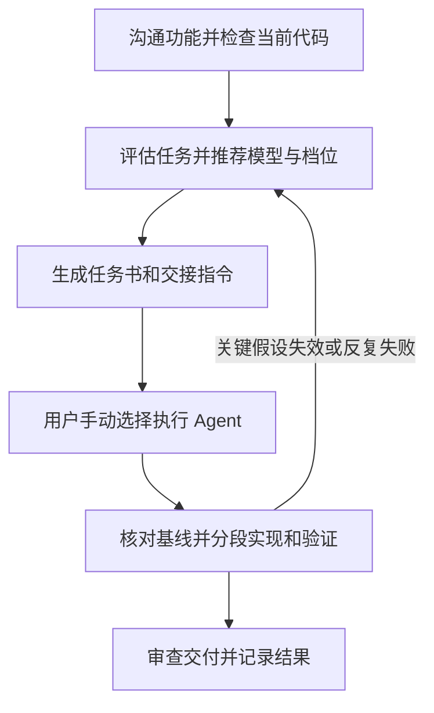

# 代码实施任务书与交接流程

本流程是 [AGENTS.md](../AGENTS.md) 的任务组织细则，配合[代码编写规范](Coding-Standards.md)执行。目标是在质量要求不变的前提下，让规划成果可以交给不同模型或不同厂商的 Agent 执行，减少重复沟通和无效返工。

当前授权、进展、开放问题及下一步以 [status.md](status.md) 为唯一来源。生成任务书不自动授权编码、提交、推送或发布；用户要求执行明确任务时，必要的局部实现、隔离测试和修复包含在该授权内，无需逐步重复批准。

## 1. 工作流程



### 第一步：沟通功能并检查当前代码

规划者先读取适用规则、当前状态及相关代码，再与用户明确目标、范围、可观察的结果和影响本轮验收的问题。区分已经确认的决定、实现建议与待查事实，保留关键决定的原因。

检查所需接口、依赖及现成实现是否存在；不能通过已读材料确认的事实标注未知。若关键技术路径尚未验证，先提出范围明确的最小验证任务，在已有授权内执行，不能把猜测写成可直接实施的方案。

### 第二步：评估任务并推荐模型与档位

功能细节明确后，规划者依据实际代码按第 2 节给出简短评估。对于需要较多判断的任务，由高能力模型完成规划；明确的小改动允许执行模型直接做简要评估，不强制每项任务使用高能力模型。

评估结论可以是直接执行、按任务书交接、先完成最小验证，或由高能力模型处理关键部分后再交接。不能为了使用较低成本模型而缩减验收要求。

### 第三步：生成任务书和交接指令

需要新任务或其他 Agent 接手时，按第 3、4 节生成仓库内可独立读取的任务书。任务以一次可独立验收的行为变化为单位；同一范围内的常规修复沿用原任务书。

向用户返回：任务 ID 与文件链接、评估摘要、首选模型及推理档位、推荐理由，以及可直接复制的执行指令。只给 ID 时必须能按约定找到唯一文件，不依赖平台内部任务 ID 或原始聊天记录。

### 第四步：用户手动选择执行 Agent

用户手动创建执行任务，选择模型与档位，转交任务书路径和执行指令；也可交给其他厂商的 Agent。执行环境须能访问对应代码、任务书及所引用的必要文件。推荐模型是建议配置，不自动创建任务、切换模型或启动并行执行。

新工作树或其他机器未必包含原目录的未提交、未跟踪文件，交接前须核对相关文件是否齐全。可以使用获授权的提交或可核对的文件快照交接，不为满足流程擅自提交。多个任务同时工作时，写入责任和隔离方式遵循 AGENTS.md。

### 第五步：核对基线并分段实现和验证

执行者先读取任务书、适用规则和当前状态，检查相关提交、未提交改动、运行环境及实际模型配置。缺少文件或权限时先明确缺口；不能假装已读或自行用猜测补齐。

基线发生变化时，判断是否影响本任务约定。无关差异不阻断工作；相关差异应查明并同步必要的任务书内容。关键假设失效时暂停受影响部分，保留可继续的独立工作，返回证据供重新评估。

按步骤完成、验证并修复每个切片。常规局部选择自主处理；出现范围变化、重要数据语义变化或持续失败时按第 2 节升级。执行者可以提出任务书有误，不得通过删除有效测试、降低校验或修改正确业务规则来符合错误方案。

### 第六步：审查交付并记录结果

执行者交回实际差异、所测代码版本、环境、验证结果、方案偏离及未解决问题。审查者检查实际代码和证据，也检查原方案是否正确，不能只阅读执行者的完成摘要。

按 AGENTS.md 第十节完成与风险相匹配的检查和独立审查。关键业务规则、跨模块难题优先由高能力模型参与审查；低风险文档修改按既有规则自检即可。记录实际审查者、方式及所审版本，缺少必要独立审查时明确保留待完成项。

在 status.md 中更新进展与开放问题，区分实现完成、验证通过、用户验收和发布完成。适用时同条简记实际模型及档位、推荐是否合适、返工与用户介入情况；仅记录能取得的用量或耗时，不推算虚假精度。详细证据较多时链接验证报告，不另建模型评测系统。

## 2. 任务评估与模型推荐

评估直接放在任务书开头，无需独立报告或新增审批。分别说明下列四个维度，并用实际发现解释判断，不按改动行数或文件数量机械打分。

| 维度 | 简短结论 | 判断依据 |
|---|---|---|
| 实现复杂度 | 低 / 中 / 高 | 逻辑分支、模块依赖、接口联动、可复用模式 |
| 错误影响 | 低 / 中 / 高 | 影响范围、可恢复性、数据与研究结果是否可能失真 |
| 技术不确定性 | 低 / 中 / 高 | 来源、接口、依赖、设计假设是否经过验证 |
| 可验证程度 | 充分 / 部分 / 不足 | 预期结果、自动化检查、真实接口或界面验证是否可用 |

评估同时包含：

- **执行建议**：直接执行、按任务书交接、先验证，或高能力模型先处理关键部分。
- **首选配置**：明确 GPT 模型全名及推理档位，附可用的配置标识；例如 `GPT-5.6 Terra · 高（high）`，模型标识 `gpt-5.6-terra`。此处只示范格式，不作为所有任务的默认推荐。
- **推荐理由与把握**：说明为什么该配置适合当前任务，标明高 / 中 / 低把握及依据；缺少同类实测时如实说明。
- **升级方案**：给出一个更适合处理已识别难点的候选模型与档位，或明确回到规划者验证哪项假设；写清触发条件和交接材料。
- **审查重点**：指出最值得独立检查的行为与证据。

选择原则：

1. 模型能力与推理档位分别判断，不默认高档，不假设小模型提高推理档位即可替代更强模型。不能把推荐把握当作成功率承诺。
2. 优先依据本项目同类任务的实际结果，其次参考当前官方定位。确认目标执行工具实际可选的模型和档位；无法核实时注明限制，不把 API 支持等同于用户工具可用。
3. 模型清单会变化，规则不维护永久的型号排名或价格表。可复用本次会话已核实且仍适用的信息，不为每个小任务重复完整调研。上述格式示例参考 [Terra 官方说明](https://developers.openai.com/api/docs/models/gpt-5.6-terra)。
4. 规划者推荐 GPT 配置，任务书正文仍使用通用文件、命令和接口表达。换用其他厂商 Agent 时保留能力要求与验收约定，不假定存在一一对应的模型或档位。
5. 升级条件须具体：例如关键契约需要改变、关键假设失效，或同一问题经过约定的有依据修复仍失败。重试边界按任务设定，不固定全项目统一次数；每次尝试应有假设及验证结果，避免无依据反复试错。
6. 升级时交回复现步骤、预期与实际结果、相关日志、代码差异、已尝试方法和剩余问题。技术诊断交给合适的执行者，产品含义、范围和重大取舍仍由用户决定。

## 3. 任务书的最小信息标准

每个代码任务开始修改前都要明确下列信息。简单改动可以合并为短段落或现有任务记录；跨任务、跨模型或跨厂商交接时，必须有可定位的仓库内任务书。无相关影响时注明不适用及必要原因，不凑篇幅。

| 项目 | 必须明确的内容 |
|---|---|
| 1. 目标与范围 | 解决的问题、可观察变化、包含与排除项；引用已确认需求及 status.md 中的授权依据 |
| 2. 当前代码依据 | 仓库及分支、提交版本、相关未提交/未跟踪改动；实际读过的代码与文档入口、当前行为、已知和未核实事实 |
| 3. 改动位置与边界 | 预计影响模块、文件、调用者和兼容性；现成实现与复用入口，必须保持的行为 |
| 4. 关键实现约定 | 输入输出、数据与错误契约、业务规则、设计依据；区分必须遵守的约定和执行者可自主选择的细节 |
| 5. 实施步骤 | 步骤依赖、每步产物和检查点；必要的运行环境、依赖准备、启动命令及隔离测试数据 |
| 6. 验收与验证 | 前置条件、输入或操作、可观察结果、验证方式与适用命令；必要正常、边界和失败场景；命令是否已实测及环境限制 |
| 7. 自主处理与升级条件 | 可自主解决的问题、重试边界、返回规划者或用户的触发条件与材料；可引用开头的评估 |
| 8. 交付要求 | 代码差异、所测版本、验证证据、方案偏离、未解决项、适用审查及文档更新要求 |

按任务补充相关内容：UI 改动附设计依据、状态与实际界面检查；数据任务附来源、单位、时间、版本、完整性和恢复约定；迁移附已有数据影响与恢复办法；权限及外部接口改动附边界、异常和实际消费者验证。具体要求引用 AGENTS.md 和代码规范，任务书只补充本轮细节。

使用仓库相对路径说明文件位置，明确命令工作目录及平台差异。不得依赖原聊天中的“刚才那个方案”，也不得假设其他 Agent 自动读取 AGENTS.md。专属工具确为必要时列明依赖、可用替代方案或缺失时的处理方式。

## 4. 文档组织与任务标识

- 交接任务默认一项一文件，首次需要时再创建 `docs/tasks/`。文件名采用 `TASK-YYYYMMDD-NN-简短名称.md`，任务 ID 为 `TASK-YYYYMMDD-NN`；创建前检查该 ID 未被占用，不复用旧 ID。
- 既有执行计划的 T01–T30、S01–S04 保持不变。任务书按需引用其具体子范围，不以完成一份任务书宣称整个路线任务完成。
- 任务书保存实施约定、制定日期及代码依据；当前授权、执行者、进展、开放问题和下一步只在 status.md 维护，并链接任务文件。不再创建另一份任务状态总表。
- 任务生成后，在 status.md 简记该任务 ID、文件链接及实际授权/进展；明确是仅形成方案，还是已有执行指令。若实际任务范围获授权后变化，及时更新相应来源，不把静态任务书当作最新授权。
- 同范围修复沿用任务书；约定改变时更新必要内容及其依据，不静默扩大范围。保留可核对的交接版本；版本追踪可用获授权的 Git 历史或交接快照，不自动触发提交。
- 只读出文件不代表具备完整上下文。执行者须能取得相关未提交代码、规范及必要引用资料；无法取得时明确缺口。

## 5. 可复制的任务书模板

模板是检查清单，填入实际信息后可合并简写。占位内容不可作为已核实事实；关键未知影响实现时，执行建议应为先验证。

```text
# TASK-YYYYMMDD-NN：任务名称
制定日期：
关联路线任务及本轮子范围（如有）：
当前授权与进展：见 docs/status.md 中本任务记录

## 执行评估
实现复杂度：低 / 中 / 高；依据：
错误影响：低 / 中 / 高；依据：
技术不确定性：低 / 中 / 高；依据：
可验证程度：充分 / 部分 / 不足；依据：
执行建议：直接执行 / 按任务书交接 / 先验证 / 高能力模型先处理关键部分
首选配置：GPT 模型全名 · 推理档位（配置标识）；可用性依据：
推荐理由及把握：
升级方案、触发条件及需交回的材料：
审查重点：

## 1. 目标与范围
目标、可观察变化、包含与排除项；需求和授权依据：

## 2. 当前代码依据
仓库、分支、提交、相关未提交/未跟踪改动及核对方式：
先读 AGENTS.md、docs/Coding-Standards.md、docs/status.md，以及本任务相关规则。
实际已读的代码/文档入口、当前行为、已知与待查事实：

## 3. 改动位置与边界
预计影响位置、复用入口、调用者与兼容性约束：

## 4. 关键实现约定
必须遵守的契约与依据、允许自主选择的实现细节：
本任务适用的 UI / 数据 / 迁移 / 权限等补充：

## 5. 实施步骤
依赖顺序、每步产物和检查点：
环境、命令工作目录、启动与隔离测试数据准备：

## 6. 验收与验证
逐条说明：前置条件 → 输入或操作 → 预期结果 → 验证方式/命令。
列明命令是否实测、必要失败场景和已知环境限制。

## 7. 自主处理与升级条件
常规自主处理范围、重试边界；引用执行评估中的升级方案：

## 8. 交付要求
代码差异、所测版本和环境、验证结果、方案偏离、未完成项：
适用审查及需更新的文档：
在 docs/status.md 记录实际执行配置、进展和必要证据，区分实现、验证、用户验收与发布。
```

## 6. 返回用户的交接格式

生成任务书后返回以下简短摘要，并将链接替换为实际可用的文件链接：

```text
任务：<任务 ID> · <名称>
任务书：<文件链接及仓库相对路径>
评估：复杂度 <等级>；错误影响 <等级>；不确定性 <等级>；可验证程度 <结论>
执行建议：<路径选择>
推荐配置：<GPT 模型全名> · <推理档位及标识>
理由与把握：<简短依据>
升级：<触发条件 → 候选配置或需重新验证的事项>
```

以下执行指令供用户决定开始该任务时复制到执行 Agent；若任务书只安排最小验证，指令也只授权该验证范围：

```text
请执行 <任务书实际路径> 中的 <任务 ID>，以该文件作为本轮实施约定。
先读取 AGENTS.md、docs/Coding-Standards.md、docs/status.md 及适用的局部规则，
核对任务书引用的代码基线、已有改动、必要资料和运行环境。
推荐配置为 <模型及推理档位>；记录实际配置，无法识别时如实说明，不自行宣称已切换。
将本条执行指令与现有授权一并记录到 docs/status.md；若与既有限制冲突，先查明。
按任务书分段实现和验证，常规内部步骤自主完成。关键假设失效时返回证据，
按升级条件处理，保留可以独立继续的工作。
交付实际差异、验证证据、方案偏离与未解决问题，并更新 docs/status.md。
Git 操作和发布遵循已有授权，本条不新增提交、推送或发布授权。
```
